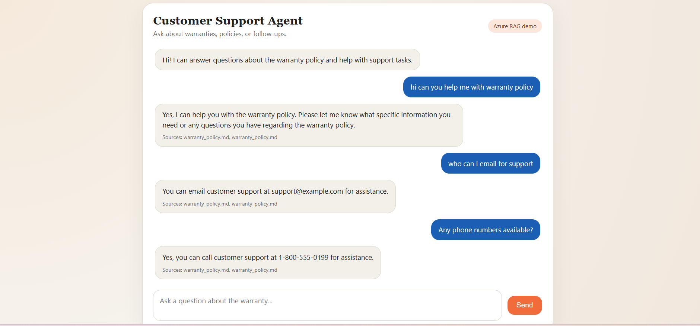
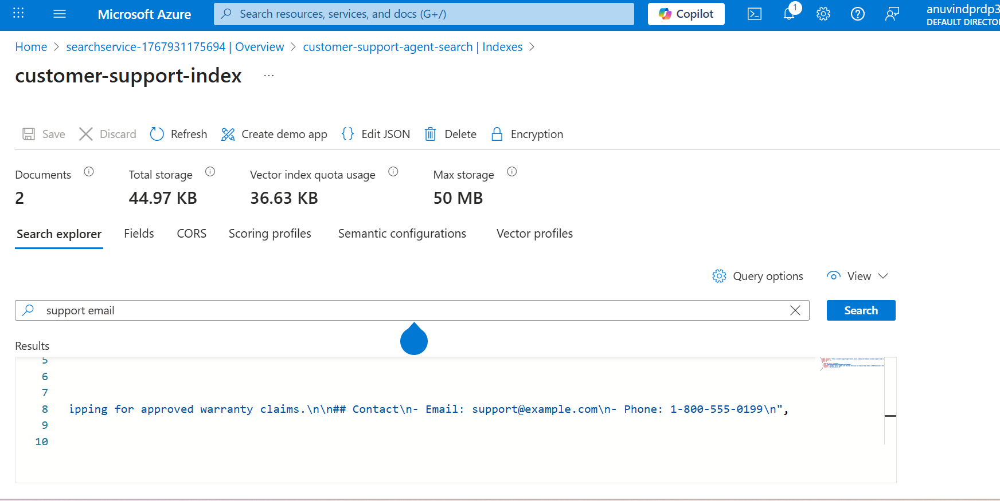
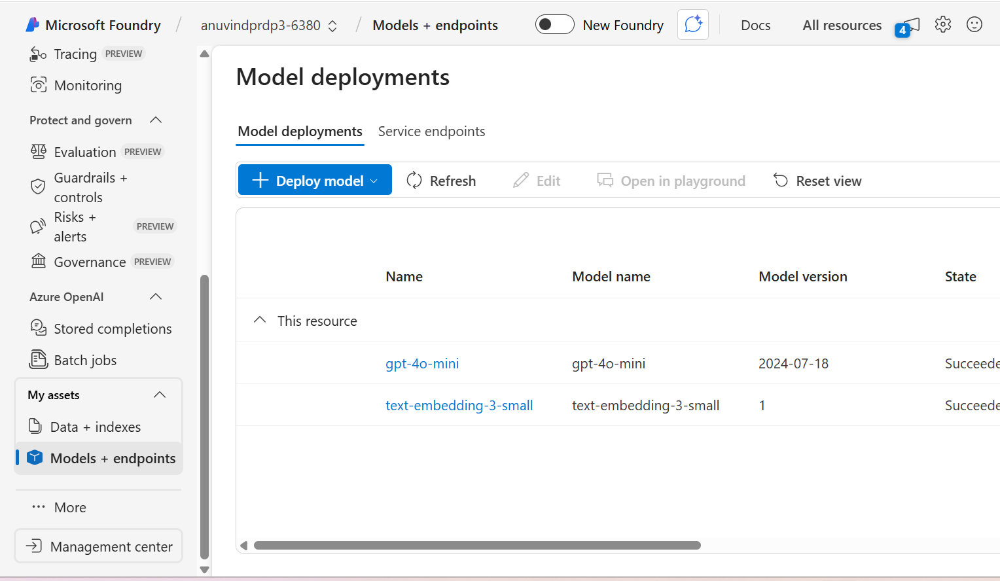
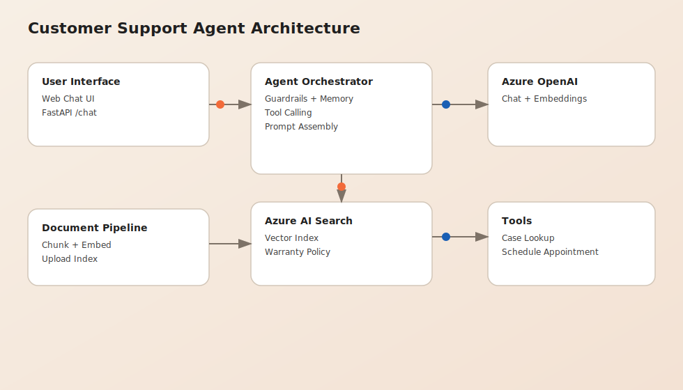

# Customer Support Agent (Azure RAG + Tools)

An end-to-end, GenAI-powered customer support agent built on Azure OpenAI and Azure AI Search.
It runs locally as a FastAPI app, supports RAG grounding, tool calling, lightweight guardrails,
and multi-turn memory. This repo is designed for learning and demo use with minimal Azure costs.

## Highlights
- Azure OpenAI for chat + embeddings.
- Azure AI Search vector index for RAG.
- Tool calling for case lookup and appointment scheduling.
- Lightweight guardrails against prompt injection and sensitive data.
- Session memory for multi-turn chat.
- Simple, responsive web UI.

## Architecture
1) User message hits FastAPI `/chat`.
2) The query is embedded with Azure OpenAI.
3) Azure AI Search retrieves top-k chunks from the warranty policy.
4) The LLM answers using the retrieved context.
5) Tool calls (if needed) are executed and fed back into the LLM.

## Screenshots
Add your screenshots to `docs/` and update the links below.






## Quick start
1) Create a Python virtual environment and install dependencies:

```bash
python -m venv .venv
.\.venv\Scripts\activate
pip install -r requirements.txt
```

2) Fill in `.env` with your Azure OpenAI and Azure AI Search settings.

3) Index the warranty document:

```bash
python scripts/index_documents.py
```

4) Run the API:

```bash
.\.venv\Scripts\uvicorn.exe app.main:app --host 127.0.0.1 --port 8000
```

5) Open the UI:

```bash
http://127.0.0.1:8000/
```

6) Test the API:

```bash
curl -X POST http://127.0.0.1:8000/chat -H "Content-Type: application/json" -d "{\"session_id\": \"demo\", \"message\": \"What does the warranty cover?\"}"
```

## Environment variables
Set these in `.env`:
- `AZURE_OPENAI_ENDPOINT`
- `AZURE_OPENAI_KEY`
- `AZURE_OPENAI_DEPLOYMENT` (chat model)
- `AZURE_OPENAI_EMBEDDING_DEPLOYMENT`
- `AZURE_AI_SEARCH_ENDPOINT`
- `AZURE_AI_SEARCH_ADMIN_KEY`
- `AZURE_AI_SEARCH_INDEX`
- Optional: `AZURE_OPENAI_API_VERSION` (defaults to 2024-02-01)

## Tools
Mocked tools live in `app/tools.py`:
- `case_lookup`: look up a support case by case_id.
- `schedule_appointment`: schedule a follow-up appointment.

Example prompts:
- "Look up case C-10023."
- "Schedule an appointment for Priya at priya@example.com on 2026-01-10 at 14:30."

## RAG indexing
The RAG pipeline ingests `warranty_policy.md` and uploads embedded chunks to Azure AI Search.
Run it any time the document changes:

```bash
python scripts/index_documents.py
```

## Azure setup checklist
1) Create Azure OpenAI resource and deploy:
   - Chat model (e.g., gpt-4o-mini)
   - Embedding model (e.g., text-embedding-3-small)
2) Create Azure AI Search (Free tier if available).
3) Copy keys + endpoints into `.env`.

## Cost notes
Azure OpenAI is pay-per-token. Keep the document small and prompts short.
Delete resources when done to minimize costs.

## Security notes
- Rotate any keys that were shared in chat.
- `.env` is gitignored and should not be committed.
